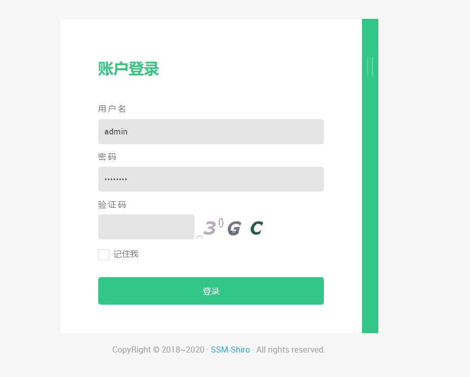
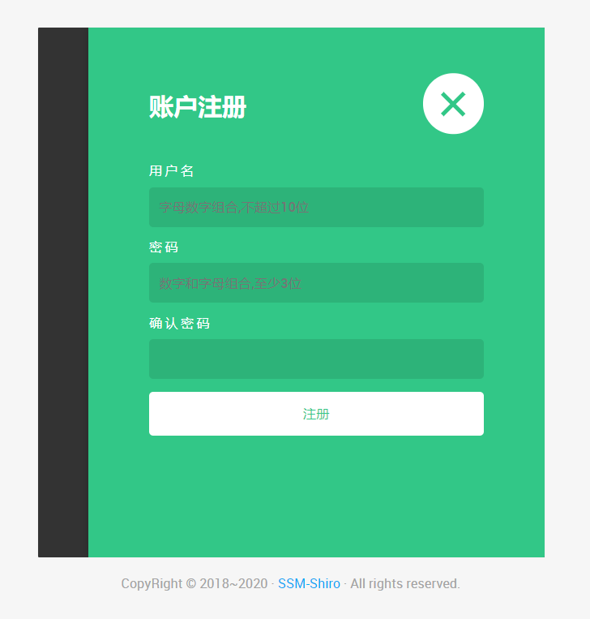
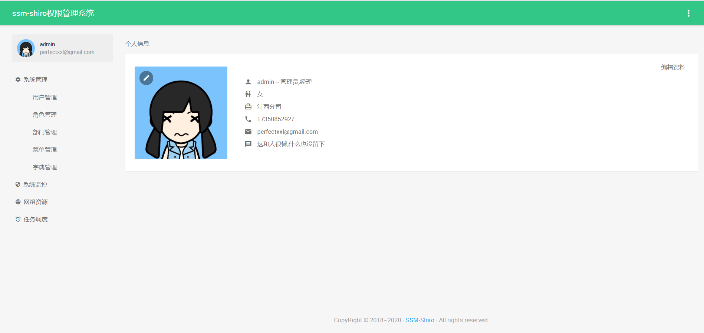
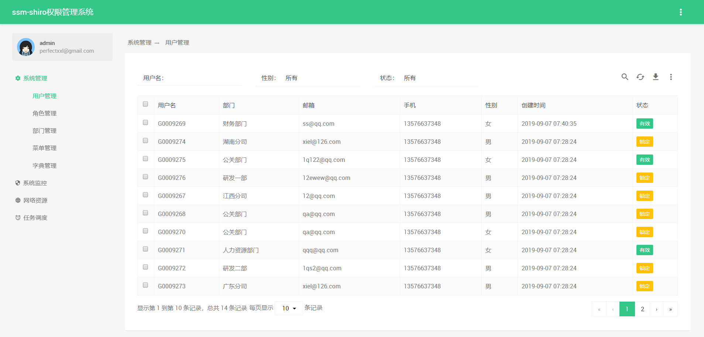
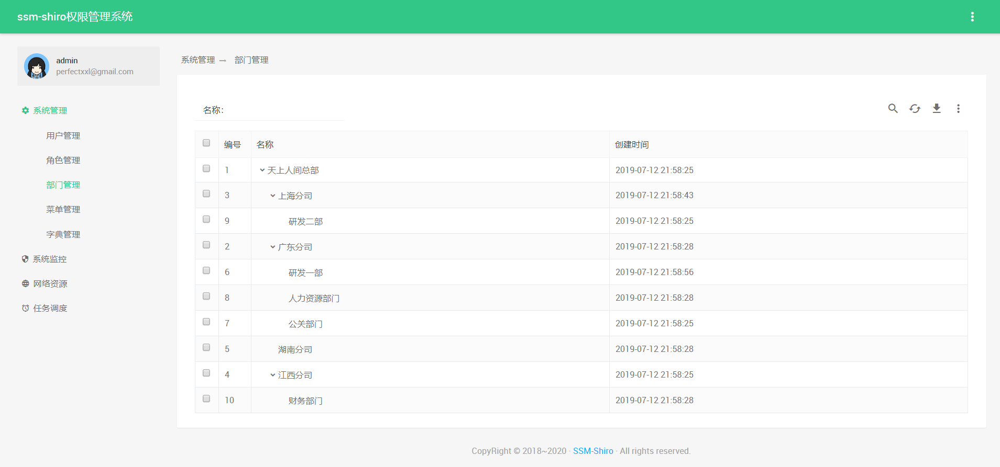
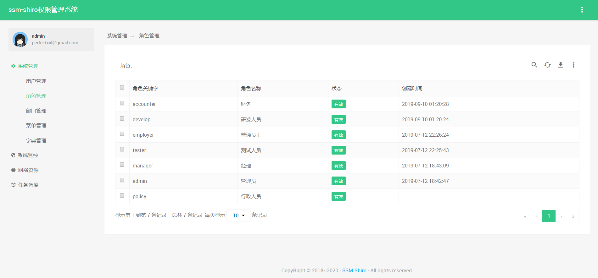
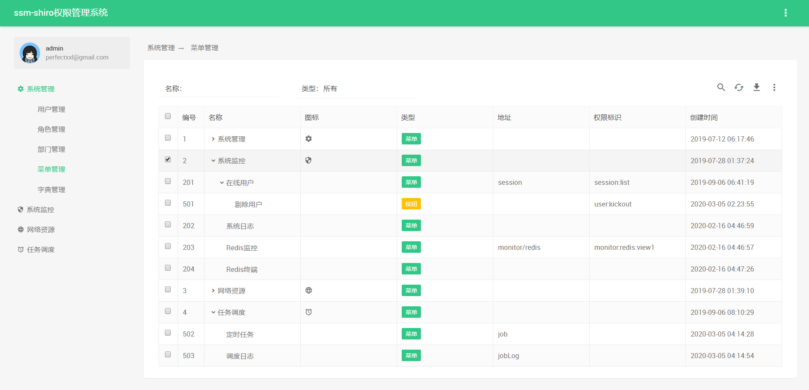
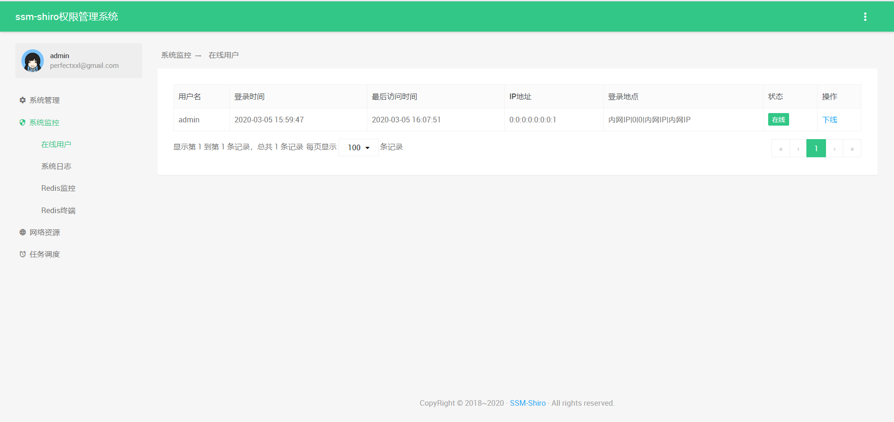
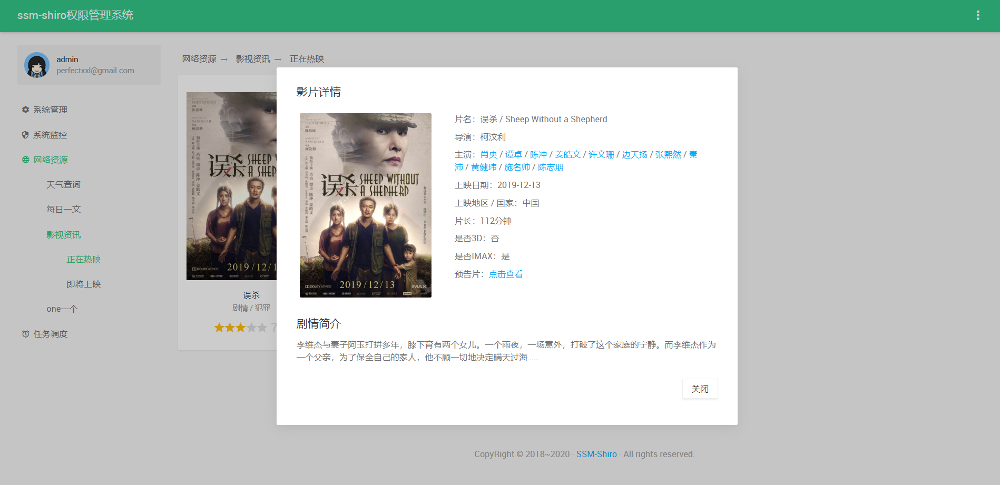

# ssm-shiro
## 一、准备工作
```
JDK >= 1.8 (推荐1.8版本)
Mysql >= 5.5.0 (推荐5.7版本)
Maven >= 3.0
IntelliJ IDEA 2019.3
```
## 二、使用技术
### 2.1 前端
+ `Bootstrap`
+ `Thymeleaf`
### 2.2后台
+ `SpringBoot`
+ `SpringMVC`
+ `Mybatis`
+ `Shiro`
+ `Redis`
+ `Maven`
+ `Redis`
+ `LomBok`
+ `MySql`

## 三、文件结构
```
ssm-shiro
├── com.xlx.shiro
│       	└── commom           // 共同部分         
│       	└── job              // 系统监控      
│       	└── system           // 系统管理     
│       	└── web              // 网络资源         
|
|
|
├── recesources         // 资源
│       └── generator              // mybatis自动生成配置
│       └── ip2region              //  ip地址解析
|
├── test   // 单元测试
|
```


## 六、 项目演示

+ URL: http://localhost:8887/ 
+ 管理员账户: admin  密码: admin
+ 账户1: G0009263 密码: G0009263
<table>
<tr>
  <td></td>
  <td></td>
</tr>
<tr>
  <td></td>
  <td></td>
</tr>
<tr>
  <td></td>
  <td></td>
</tr>
<tr>
  <td></td>
  <td></td>
</tr>
<tr>
  <td></td>
  <td></td>
</tr>
</table>

## 七、 Contributor
[@猕猴桃](https://github.com/XielinX)